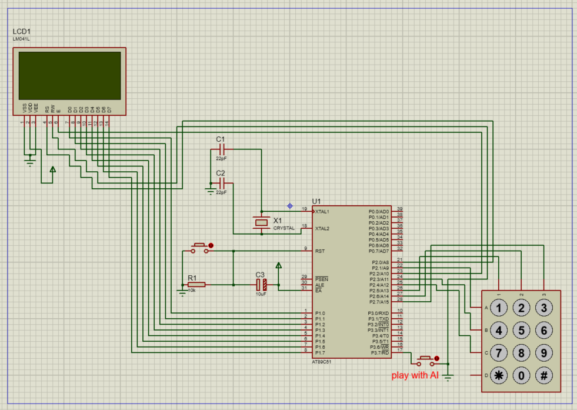

# tic-tac-toe-8051
Tic-Tac-Toe game on AT89C51 microcontroller using 8051 assembly with LCD display, matrix keypad, and AI opponent
# 🎮 Tic-Tac-Toe — AT89C51 Assembly


A fully functional Tic-Tac-Toe game implemented in bare-metal 8051 assembly
for the AT89C51 microcontroller. Features a 4×4 matrix keypad for input,
LM041L LCD for display, two game modes (PvP and PvAI), and an intelligent
AI opponent with a 5-level priority strategy.

---

## 👤 Author

| Field | Details |
|---|---|
| **Name** | Siam Al Shafin |
| **Student ID** | 210021316 |

---

## 📸 Demo



---

## ✨ Features

- ♟️ **Two Game Modes** — Player vs Player (PvP) and Player vs AI (PvAI)
- 🤖 **AI Opponent** — 5-level priority: Win → Block → Center → Corners → Edges
- 🖥️ **LCD Display** — Real-time board rendering on LM041L 4-line LCD
- ⌨️ **Matrix Keypad** — 3×3 cell selection via 4×4 keypad (keys 1–9)
- 🔄 **Mode Toggle** — Single button (P3.7) switches mode and resets board
- ⚡ **Bare Metal** — No OS, no libraries — pure 8051 assembly
- 🏆 **Win Detection** — All 8 lines checked (3 rows, 3 cols, 2 diagonals)
- 🤝 **Draw Detection** — Detects board-full with no winner

---
---

## 🕹️ How to Play

### Board Layout
```
1 | 2 | 3
---------
4 | 5 | 6
---------
7 | 8 | 9
```

### Controls
| Key | Position |
|---|---|
| `1` | Top-Left |
| `2` | Top-Center |
| `3` | Top-Right |
| `4` | Mid-Left |
| `5` | Center ⭐ |
| `6` | Mid-Right |
| `7` | Bot-Left |
| `8` | Bot-Center |
| `9` | Bot-Right |
| `P3.7 Button` | Toggle PvP ↔ PvAI + Reset |

### Game Rules
- Player **X** always goes first
- Press **1–9** to place your symbol
- First to get **3 in a row** wins
- All 9 cells filled with no winner → **DRAW**
- Occupied cell press → **INVALID** shown on LCD

### Game Modes
**PvP — Player vs Player**
- Two players take turns on the same keypad
- LCD shows `TURN: X` or `TURN: O`

**PvAI — Player vs Computer**
- You are **X**, AI plays as **O**
- LCD shows `YOUR TURN` or `AI TURN`

### LCD Messages
| Message | Meaning |
|---|---|
| `TURN: X` | Player X's turn (PvP) |
| `TURN: O` | Player O's turn (PvP) |
| `YOUR TURN` | Your turn (PvAI) |
| `AI TURN` | AI is playing (PvAI) |
| `X PLAYER WON` | X wins (PvP) |
| `O PLAYER WON` | O wins (PvP) |
| `YOU WON` | You beat the AI |
| `AI WON` | AI beat you |
| `DRAW` | Board full, no winner |
| `INVALID` | Cell already occupied |
```

---
---

## 🛠️ Hardware

| Component | Details |
|---|---|
| Microcontroller | AT89C51 (8051-compatible, 4KB Flash) |
| Display | LM041L LCD — 4-line, 8-bit bus via P1 |
| Input | 4×4 Matrix Keypad (3×3 cells used) |
| Clock | Crystal oscillator + 22pF caps |
| Mode Button | P3.7 — Active LOW, debounced |
| Simulator | Proteus DSP |

---

## 📌 Pin Mapping

| Signal | MCU Pin | Description |
|---|---|---|
| LCD Data D0–D7 | P1.0–P1.7 | 8-bit data bus |
| LCD RS | P2.0 | Register Select (0=Cmd, 1=Data) |
| LCD Enable | P2.2 | Strobe to latch data |
| LCD RW | GND | Write-only (tied low) |
| Keypad Row 1 | P2.1 | Drive LOW → scan keys 1, 2, 3 |
| Keypad Row 2 | P2.3 | Drive LOW → scan keys 4, 5, 6 |
| Keypad Row 3 | P2.4 | Drive LOW → scan keys 7, 8, 9 |
| Keypad Col 1–3 | P2.5–P2.7 | Column detect (pull-up required) |
| Mode Button | P3.7 | Active LOW — toggle game mode |

---

## 🧠 Board Storage

The 8051 has only 8 working registers (R0–R7). All 9 board cells are mapped as:

| Register | Cell | Position |
|---|---|---|
| R0 | 1 | Top-Left |
| R1 | 2 | Top-Center |
| R2 | 3 | Top-Right |
| R3 | 4 | Mid-Left |
| R4 | 5 | **CENTER ★** |
| R5 | 6 | Mid-Right |
| R6 | 7 | Bot-Left |
| R7 | 8 | Bot-Center |
| DPL | 9 | Bot-Right |

> **DPL Trick:** Since the board needs 9 slots but only 8 registers exist,
> `DPL` (low byte of DPTR, SFR at 82h) is repurposed as Cell 9.
> DPTR is unused since there is no external RAM in this project.

### Cell Values
- `00h` = Empty
- `58h` = `'X'` (Player 1)
- `4Fh` = `'O'` (Player 2 / AI)

---

## 🤖 AI Strategy

The AI uses a deterministic priority waterfall (no randomness):

| Priority | Strategy | Description |
|---|---|---|
| 1 | **WIN** | Complete a line (2× O + 1 empty → play there) |
| 2 | **BLOCK** | Stop the player (2× X + 1 empty → block it) |
| 3 | **CENTER** | Take cell 5 (R4) — intersects 4 win lines |
| 4 | **CORNERS** | Try R0 → R2 → R6 → DPL in order |
| 5 | **EDGES** | Take R1 → R3 → R5 → R7 as last resort |

---

## 🗂️ Project Structure
```
tic-tac-toe-8051/
├── src/
│   └── tic10_fixed.asm            ← Main 8051 assembly source
├── simulation/
│   └── ticai.pdsprj          ← Proteus DSP project file
├── hex/
│   └── tic10_fixed.hex            ← Compiled Intel HEX output
├── docs/
│   ├── circuit-diagram.png  ← Proteus schematic screenshot
│   └── pin-mapping.md       ← Port & pin reference
└── README.md
```

---

## 🚀 How to Run

### Simulate in Proteus
1. Install **Proteus DSP** (version 8 or above)
2. Open `simulation/ticai.pdsprj`
3. Double-click the AT89C51 chip → load `hex/tic10_fixed.hex`
4. Click **Play ▶** to start simulation
5. Use the on-screen keypad (keys 1–9) to play
6. Press **P3.7** button to toggle between PvP and PvAI

### Compile from Source
1. Install **Mide-51** (free 8051 assembly IDE)
2. Open `src/tic10_fixed.asm`
3. Press **F9** to build
4. The `.hex` file is generated in the same folder

---

## ⚠️ Known Constraints & Solutions

| Challenge | Solution |
|---|---|
| 9 cells but only 8 registers | DPL (SFR 82h) repurposed as Cell 9 |
| ACALL address range errors | All ACALL → LCALL for full 64KB reach |
| Keypad contact bounce | SMALLDEB (30-iter loop) + WAITREL until columns go HIGH |
| No reset after win | Press MODE button (P3.7) to restart game |

---

## 📄 License

This project is licensed under the MIT License — see the [LICENSE](LICENSE) file.
